# Class Diagram - KESDAM VCS

Diagram kelas untuk sistem Manajemen Penjadwalan dan Surat Menyurat KESDAM III/Siliwangi.

## Diagram UML (Mermaid)

```mermaid
classDiagram
    %% ==========================================
    %% USER MANAGEMENT (Single Table Inheritance)
    %% ==========================================
    
    class User {
        +int id
        +string nrp
        +string rank
        +string position
        +string unit
        +string name
        +string email
        +string phone
        +string address
        +string profile_photo
        +boolean is_active
        +string password
        +datetime email_verified_at
        +datetime last_login_at
        +datetime created_at
        +datetime updated_at
        +roles()
        +permissions()
        +hasRole(role)
        +hasPermission(permission)
        +assignRole(role)
        +removeRole(role)
        +getFullRankName()
        +getFullPositionName()
    }
    
    class AdminSistem {
        <<extends User>>
        +type = 'admin_sistem'
    }
    
    class Pimpinan {
        <<extends User>>
        +type = 'pimpinan'
    }
    
    class Kasi {
        <<extends User>>
        +type = 'kasi'
    }
    
    class Kaur {
        <<extends User>>
        +type = 'kaur'
    }
    
    class Batih {
        <<extends User>>
        +type = 'batih'
    }
    
    class Staff {
        <<extends User>>
        +type = 'staff'
    }
    
    User <|-- AdminSistem
    User <|-- Pimpinan
    User <|-- Kasi
    User <|-- Kaur
    User <|-- Batih
    User <|-- Staff
    
    %% ==========================================
    %% ROLE & PERMISSION
    %% ==========================================
    
    class Role {
        +int id
        +string name
        +string display_name
        +string description
        +datetime created_at
        +datetime updated_at
        +users()
        +permissions()
        +hasPermission(permissionName)
        +givePermissionTo(permission)
        +revokePermissionTo(permission)
    }
    
    class Permission {
        +int id
        +string name
        +string display_name
        +string description
        +string category
        +datetime created_at
        +datetime updated_at
        +roles()
        +users()
    }
    
    User "*" -- "*" Role : has
    Role "*" -- "*" Permission : has
    User "*" -- "*" Permission : has
    
    %% ==========================================
    %% DOCUMENT MANAGEMENT
    %% ==========================================
    
    class Surat {
        +int id
        +string type
        +string classification
        +string number
        +date date
        +string sender
        +string recipient
        +string subject
        +string description
        +array attachments
        +string status
        +string priority
        +boolean is_encrypted
        +datetime archived_at
        +int created_by
        +int updated_by
        +datetime deleted_at
        +datetime created_at
        +datetime updated_at
        +creator()
        +updater()
        +approvalHistories()
        +currentApprover()
        +corrections()
        +arsip()
        +auditLogs()
        +encrypt()
        +decrypt()
        +generateDocumentNumber()
        +isApproved()
        +isPending()
        +canBeEditedBy(user)
    }
    
    class SuratMasuk {
        <<extends Surat>>
        +type = 'masuk'
        +string sender_organization
        +string received_by
        +datetime received_date
    }
    
    class SuratKeluar {
        <<extends Surat>>
        +type = 'keluar'
        +string recipient_organization
        +string sent_by
        +datetime sent_date
    }
    
    Surat <|-- SuratMasuk
    Surat <|-- SuratKeluar
    
    class Lampiran {
        +int id
        +int document_id
        +string file_name
        +string file_path
        +string file_type
        +int file_size
        +boolean is_encrypted
        +int uploaded_by
        +datetime uploaded_at
        +datetime created_at
        +datetime updated_at
        +document()
        +uploader()
        +download()
        +delete()
    }
    
    Surat "1" -- "*" Lampiran : has attachments
    User "1" -- "*" Surat : creates
    User "1" -- "*" Lampiran : uploads
    
    %% ==========================================
    %% APPROVAL WORKFLOW
    %% ==========================================
    
    class ApprovalWorkflow {
        +int id
        +string name
        +string document_type
        +string classification
        +array approval_chain
        +boolean is_active
        +int priority
        +datetime deleted_at
        +datetime created_at
        +datetime updated_at
        +ambilDetailRantaiPersetujuan()
        +getApprovalChainDetails()
        +findWorkflowFor(documentType, classification)
        +activate()
        +deactivate()
    }
    
    class ApprovalHistory {
        +int id
        +int document_id
        +int user_id
        +string action
        +string status
        +string comment
        +string current_approver_role
        +int approval_level
        +string ip_address
        +string user_agent
        +datetime action_date
        +datetime created_at
        +datetime updated_at
        +dokumen()
        +document()
        +user()
        +signature()
        +scopeForDocument(documentId)
        +scopeByAction(action)
        +scopePending()
        +scopeApproved()
        +scopeRejected()
    }
    
    class ApprovalSignature {
        +int id
        +int approval_history_id
        +int user_id
        +string signature_type
        +string signature_path
        +string signature_data
        +datetime signed_at
        +string ip_address
        +datetime created_at
        +datetime updated_at
        +approvalHistory()
        +user()
        +getSignatureUrl()
    }
    
    class CorrectionRequest {
        +int id
        +int document_id
        +int requested_by
        +string reason
        +string status
        +int reviewed_by
        +datetime reviewed_at
        +string review_notes
        +datetime created_at
        +datetime updated_at
        +document()
        +requester()
        +reviewer()
        +approve()
        +reject()
    }
    
    class ApprovalDeadline {
        +int id
        +int document_id
        +int approver_id
        +datetime deadline
        +boolean is_extended
        +string extension_reason
        +boolean reminder_sent
        +datetime created_at
        +datetime updated_at
        +document()
        +approver()
        +isOverdue()
        +extend(newDeadline, reason)
    }
    
    class ApprovalRolePermission {
        +int id
        +int role_id
        +string document_type
        +string classification
        +boolean can_approve
        +boolean can_reject
        +boolean can_correct
        +int approval_level
        +datetime created_at
        +datetime updated_at
        +role()
    }
    
    Surat "1" -- "*" ApprovalHistory : has
    User "1" -- "*" ApprovalHistory : performs
    ApprovalHistory "1" -- "0..1" ApprovalSignature : has
    Surat "1" -- "*" CorrectionRequest : has
    User "1" -- "*" CorrectionRequest : requests
    Surat "1" -- "*" ApprovalDeadline : has
    User "1" -- "*" ApprovalDeadline : receives
    Role "1" -- "*" ApprovalRolePermission : has
    
    %% ==========================================
    %% SCHEDULE MANAGEMENT
    %% ==========================================
    
    class Jadwal {
        +int id
        +string type
        +string title
        +string description
        +date start_date
        +date end_date
        +time start_time
        +time end_time
        +string location
        +array personnel
        +string status
        +string notes
        +int created_by
        +int updated_by
        +datetime deleted_at
        +datetime created_at
        +datetime updated_at
        +creator()
        +updater()
        +personnelUsers()
        +isActive()
        +isUpcoming()
        +isPast()
        +hasConflict()
    }
    
    class Schedule {
        <<alias Jadwal>>
        +type enum: dukkes, jaga, kegiatan_satuan
    }
    
    Jadwal <|-- Schedule
    User "1" -- "*" Jadwal : creates
    User "*" -- "*" Jadwal : assigned to
    
    %% ==========================================
    %% ARCHIVE & REPORTING
    %% ==========================================
    
    class Arsip {
        +int id
        +int document_id
        +string archive_code
        +string category
        +int archived_by
        +datetime archived_date
        +string storage_location
        +string retention_period
        +datetime disposal_date
        +string notes
        +datetime created_at
        +datetime updated_at
        +document()
        +archivedBy()
        +isExpired()
        +extend(newDate)
    }
    
    class Archive {
        <<alias Arsip>>
    }
    
    Arsip <|-- Archive
    Surat "1" -- "0..1" Arsip : archived as
    User "1" -- "*" Arsip : archives
    
    class Laporan {
        +int id
        +string type
        +string title
        +date period_start
        +date period_end
        +string format
        +string file_path
        +int generated_by
        +datetime generated_at
        +array filters
        +array data
        +datetime created_at
        +datetime updated_at
        +generator()
        +generate()
        +download()
        +delete()
    }
    
    class Report {
        <<alias Laporan>>
    }
    
    Laporan <|-- Report
    User "1" -- "*" Laporan : generates
    
    %% ==========================================
    %% AUDIT & LOGGING
    %% ==========================================
    
    class AuditLog {
        +int id
        +int user_id
        +string event
        +string auditable_type
        +int auditable_id
        +json old_values
        +json new_values
        +string ip_address
        +string user_agent
        +string description
        +datetime created_at
        +datetime updated_at
        +user()
        +auditable()
        +scopeByUser(userId)
        +scopeByEvent(event)
        +scopeByDate(startDate, endDate)
    }
    
    User "1" -- "*" AuditLog : performs
    AuditLog "*" -- "1" Surat : tracks
    AuditLog "*" -- "1" Jadwal : tracks
    
    class RiwayatPerubahan {
        +int id
        +string entity_type
        +int entity_id
        +int user_id
        +string action
        +json before_data
        +json after_data
        +string reason
        +datetime created_at
        +user()
        +entity()
    }
    
    User "1" -- "*" RiwayatPerubahan : creates
    
    %% ==========================================
    %% SETTINGS & PREFERENCES
    %% ==========================================
    
    class Setting {
        +int id
        +string key
        +string value
        +string type
        +string group
        +string description
        +datetime created_at
        +datetime updated_at
        +get(key, default)
        +set(key, value)
        +getByGroup(group)
    }
    
    class NotificationPreference {
        +int id
        +int user_id
        +boolean email_notifications
        +boolean system_notifications
        +boolean approval_reminders
        +boolean schedule_reminders
        +boolean document_updates
        +datetime created_at
        +datetime updated_at
        +user()
        +updatePreferences(preferences)
    }
    
    User "1" -- "1" NotificationPreference : has
```

## Penjelasan Diagram

### 1. **User Management (Single Table Inheritance)**
- `User` sebagai base class untuk semua tipe pengguna
- 6 tipe pengguna: AdminSistem, Pimpinan, Kasi, Kaur, Batih, Staff
- Menggunakan pattern STI (Single Table Inheritance) dengan kolom `type`
- Relasi many-to-many dengan Role dan Permission

### 2. **Role & Permission (RBAC)**
- Sistem Role-Based Access Control
- Role memiliki banyak permissions
- User dapat memiliki banyak roles
- Mendukung granular permission management

### 3. **Document Management**
- `Surat` sebagai base class untuk dokumen
- Inheritance: SuratMasuk dan SuratKeluar
- Klasifikasi: Biasa, Rahasia, Telegram
- Support enkripsi untuk dokumen rahasia
- Relasi dengan Lampiran (attachments)

### 4. **Approval Workflow**
- `ApprovalWorkflow`: Definisi alur persetujuan
- `ApprovalHistory`: Tracking setiap aksi persetujuan
- `ApprovalSignature`: Menyimpan tanda tangan (digital/manual)
- `CorrectionRequest`: Request koreksi dokumen
- `ApprovalDeadline`: Manajemen deadline dengan reminder
- `ApprovalRolePermission`: Hak approval berdasarkan role

### 5. **Schedule Management**
- `Jadwal` untuk manajemen penjadwalan
- 3 tipe jadwal: Dukkes, Jaga, Kegiatan Satuan
- Support multi-personnel assignment
- Conflict detection

### 6. **Archive & Reporting**
- `Arsip`: Pengarsipan dokumen dengan kode dan kategori
- `Laporan`: Generate berbagai jenis laporan
- Retention period management
- Multiple export formats

### 7. **Audit & Logging**
- `AuditLog`: Complete audit trail untuk semua entitas
- `RiwayatPerubahan`: Tracking perubahan data
- Menyimpan old_values dan new_values
- IP address dan user agent tracking

### 8. **Settings & Preferences**
- `Setting`: System-wide configuration
- `NotificationPreference`: User-specific preferences
- Grouped settings support

## Relationships Summary

| From | Relationship | To | Description |
|------|--------------|-----|-------------|
| User | 1:N | Surat | User creates documents |
| User | M:N | Role | User has roles |
| Role | M:N | Permission | Role has permissions |
| Surat | 1:N | Lampiran | Document has attachments |
| Surat | 1:N | ApprovalHistory | Document has approval history |
| Surat | 1:1 | Arsip | Document archived |
| ApprovalHistory | 1:1 | ApprovalSignature | History has signature |
| User | 1:N | Jadwal | User creates schedules |
| User | M:N | Jadwal | User assigned to schedules |
| User | 1:N | AuditLog | User performs actions |
| User | 1:1 | NotificationPreference | User has preferences |

## Design Patterns Used

1. **Single Table Inheritance (STI)**: User types, Document types
2. **Repository Pattern**: Data access layer
3. **Service Layer Pattern**: Business logic separation
4. **Observer Pattern**: Model events and audit logging
5. **Strategy Pattern**: Different approval workflows
6. **Factory Pattern**: Model factories for testing
7. **Facade Pattern**: Service classes

## SOLID Principles Applied

- **S**: Single Responsibility - Each model has one clear purpose
- **O**: Open/Closed - Extensible through inheritance and interfaces
- **L**: Liskov Substitution - Child classes are substitutable
- **I**: Interface Segregation - Focused interfaces and traits
- **D**: Dependency Inversion - Depends on abstractions (contracts)

---

**Generated:** January 1, 2026  
**Version:** 1.0  
**Project:** KESDAM VCS - Manajemen Penjadwalan dan Surat Menyurat
